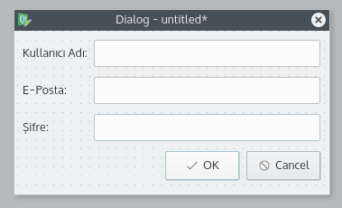
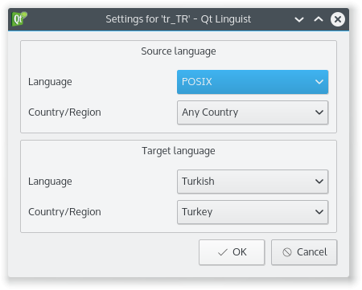
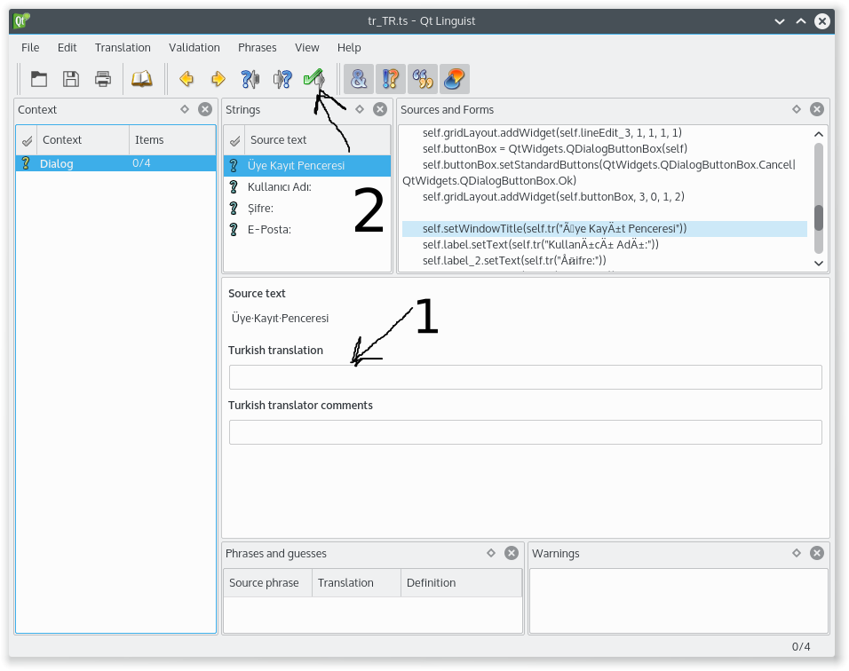

# PyQt Uygulamasında Çoklu Dil Desteği

PyQt ile bir seviyeye kadar ilerledikten sonra insan yaptığı programın kendi dilini konuşmayan kişilerinde kullanmasını isteyebilir.

Python'u öğrendiniz, bir çok hata ve zorlukla karşılaşarak PyQt de ortalama bir seviyeye geldiniz ve artık bir çok insanın kullanacağı bir program yazmaya karar verdiniz. Tabii Türk kullanıcıları size az geldi ve programınızın yurt dışına açılmasını istiyorsunuz. Yani kısaca programınız için dil desteği eklemek istiyorsunuz. PyQt ya da Qt bu konuda ihtiyacımız olan modülleri içeriyor.

Örnek, basit bir uygulama üzerinden anlaşılır bir şekilde nasıl yapılacağını anlatacağım... Uygulamamız bir kullanıcı kayıt dialogu olsun:



Qt Designer ile bu şekilde bir dialog tasarladık ve projeyi kaydedip dosyanın bulunduğu dizinde

```text
pyuic5 proje_dosyası.ui -o dialog.py
```

komutunu girip Python dosyasını elde ettiniz\(PyQt4 kullanıcıları pyuic4 yazmalıdır\). Üretilen kod hemen kullanıma hazır olmadığı için ve işimize yaramayan kodlar barındırdığı için ben çalışır duruma getirdiğim kodu buraya koyuyorum.

```text
from PyQt5 import QtCore, QtGui, QtWidgets
import sys

class Dialog(QtWidgets.QDialog):
    def __init__(self, parent=None):
        super(Dialog, self).__init__(parent)
        self.resize(350, 180)
        self.gridLayout = QtWidgets.QGridLayout(self)
        self.label = QtWidgets.QLabel(self)
        self.gridLayout.addWidget(self.label, 0, 0, 1, 1)
        self.lineEdit = QtWidgets.QLineEdit(self)
        self.gridLayout.addWidget(self.lineEdit, 0, 1, 1, 1)
        self.lineEdit_2 = QtWidgets.QLineEdit(self)
        self.gridLayout.addWidget(self.lineEdit_2, 2, 1, 1, 1)
        self.label_2 = QtWidgets.QLabel(self)
        self.gridLayout.addWidget(self.label_2, 2, 0, 1, 1)
        self.label_3 = QtWidgets.QLabel(self)
        self.gridLayout.addWidget(self.label_3, 1, 0, 1, 1)
        self.lineEdit_3 = QtWidgets.QLineEdit(self)
        self.gridLayout.addWidget(self.lineEdit_3, 1, 1, 1, 1)
        self.buttonBox = QtWidgets.QDialogButtonBox(self)
        self.buttonBox.setStandardButtons(QtWidgets.QDialogButtonBox.Cancel|QtWidgets.QDialogButtonBox.Ok)
        self.gridLayout.addWidget(self.buttonBox, 3, 0, 1, 2)

        self.setWindowTitle("Üye Kayıt Penceresi")
        self.label.setText("Kullanıcı Adı:")
        self.label_2.setText("Şifre:")
        self.label_3.setText("E-Posta:")

app = QtWidgets.QApplication(sys.argv)
dialog = Dialog()
dialog.show()
sys.exit(app.exec_())
```

Bu kodu dialog.py adıyla kaydedip

```text
python3 dialog.py
```

komutuyla çalıştırabilirler. Karşınıza yukarıdaki gibi bir arayüz çıkacaktır.

Şimdi bu kod üzerinden adım adım nasıl dil desteği eklenir ona gelelim...

Öncelikle kodumuzda bulunan QLabel lere girdiğimiz stringleri çevrilebilir olması için her pencere aracında bulunan tr\(\) methodunu kullanacağız. Eğer siz PyQt4 ve Python'un 2x sürümünü kullanıyorsanuz bu trUtf8\(\) methodunu kullanmalısınız. Bunun nedeni Python 2x sürümün de utf-8 in ön tanımlı olmamasıdır. O zaman her string veriyi self.tr\(\) içine alalım.

```text
self.setWindowTitle(self.tr("Üye Kayıt Penceresi"))
self.label.setText(self.tr("Kullanıcı Adı:"))
self.label_2.setText(self.tr("Şifre:"))
self.label_3.setText(self.tr("E-Posta:"))
```

Bu şekilde yukarıdaki string verileri çevrilebilir özelliği kazandırdık. Şimdi dialog.pro adında bir dosya oluşturup içine şunu yazalım:

```text
SOURCES += dialog.py
TRANSLATIONS += tr_TR.ts
```

Ve aynı dizinde şu komutu verelim:

```text
pylupdate5 dialog.pro
```

Aynı dizinde tr\_TR.ts adında xml formatında bir dosya oluştu. Bu dosya bizim henüz işlenmemiş dil dosyamız oluyor.

Windows kullanıcıları PyQt'nin kurulu olduğu dizine girip linguist.exe programını çalıştırsınlar. Linux dağıtımı kullananlar ise kurulu değil ise paket yöneticisinden kurup çalıştırsınlar. Program boş pencere olarak açılır. ToolBar'dan 'Open' butonuna tıklayıp tr\_TR.ts dosyanızı seçin. Karşınıza şöyle bir dialog penceresi çıkacaktır.



Kaynak dilimiz Türkçe olduğuna göre **Source Language** kısmındaki **Language**'yi Turkish **Country/Region** kısmından da Turkey'i seçeceğiz. Hedef dilimiz de aynı şekilde Turkish ve Turkey seçelim ve Tamama basalım.

Her ne kadar kodlarımızda Türkçe kullandığımız için tr\_TR dosyası olmasa da Türkçe işletim sistemlerinde sıkıntı çekmeyeceğimize rağmen mevcut bir tr\_TR dosyası olması iyi olur.

Karşınıza çıkan ekran da Türkçe karakterlerin bozuk gözüktüğünü göreceksiniz. Mevcut dönüştürücü\(pylupdate5\) ne yazık ki bu şekilde çıktı üretiyor. İsterseniz bunları metin düzenleyici ile düzeltebilirsiniz. Ya da isterseniz kaynak dili İngilizce yapıp çevirinizi İngilizceden Türkçeye de yapabilirsiniz. Ben çevirilecek veri az olduğu için metin düzenleyici ile Türkçe karakterleri düzeltip çeviriyi yapacağım.



Metin düzenleyici ile düzenledim ve Linguist ile dil dosyamı açtım. Yukarıdaki ekran görüntüsünden de anlayabileceğiniz gibi çevrilecek metini seçip 1 numaralı okun bulunduğu yere çevrilmiş halini yazıyoruz. **Source text** kısmında bulunan metinlerin başındaki simgeler sizin çevirinizin doğru kurallara göre yapılıp yapılmadığını gösterir. Koyu yeşil bir soru işareti varsa çevrilmiş bir metin girişi olmamıştır. Ünlem işareti varsa noktalama gibi bazı kuralları girmemişsinizdir\(Misal iki nokta üst üste\). Eğer açık yeşil bir soru işareti varsa onaylanmayı bekliyordur. 2 numaralı okun gösterdiği onay butonuna tıklayarak çevirinizi onaylarsınız. Eğer bir hata yok ise soru işareti simgeleri onay simgesine dönüşür. Tüm çevirileri onayladığınızda da Context alanındaki simgeler de onay simgesine dönüşür. Eğer doğru bir şekilde çevirinizi yaptıysanız dosyanızı kaydedin.

Artık elimizde çevirisi yapılmış bir dil dosyası var. İngilizce dil dosyası için de dialog.pro dosyasından tr\_TR.ts yi silip en\_US.ts yaparak en\_US.ts adında dil dosyası üretip aynı işlemleri tekrarlayarak bu sefer İngilizce dil desteğini sağlayalım.

Bu işlemleri de bitirdikten sonra elimizde kaynak dil dosyası ile Amerikan İngilizcesine ait bir dil dosyamız oldu. Bu ham verileri olduğu şekilde kullanamayız. Bu dosyaları \*.qm dosyasına dönüştürüp Qt nin anlayacağı şekle sokacağız. Bunun için konsol da sırasıyla:

```text
lrelease tr_TR.ts

lrelease en_US.ts
```

komutunu verelim ve tr\_TR.qm ve en\_US.qm dosyasını elde edelim.

Bu dil dosyalarını isterseniz dialog.py ile aynı dizin içerisine isterseniz diller gibi bir ad ile dizin oluşturup içine atabilirsiniz.

Şimdi bu dil dosyalarını uygulamamızda kullanmak için gerekli düzenlemeyi yapalım:

```text
app = QtWidgets.QApplication(sys.argv)
local = QtCore.QLocale.system().name()
translator = QtCore.QTranslator()
translator.load("{}.qm".format(local))
app.installTranslator(translator)
dialog = Dialog()
dialog.show()
sys.exit(app.exec_())
```

QLocal sınıfı işletim sisteminin dilini bulmamızı sağlar. yukarıdaki kodda görüldüğü gibi local değişkenine sistem dilinin adını atıyoruz. Eğer print\(\) fonksiyonu ile local değişkenini yazdırırsanız işletim sisteminizin diline göre bir çıktı elde edeceksiniz. Türkçe bir sistem ise sonuç tr\_TR dir.

Sistem dilimizi öğrendik. Bu bilgi, aynı ismi verdiğimiz dil dosyalarını uygulamamızın kullanabilmesine yarıyacak. QTranslator sınıfının load\(\) methoduna dil dosyamızın aynı dizin içinde olduğunu varsayarak sistem diline göre değer ataması yapıyoruz.

Son olarak QApplication sınıfının installTranslator\(\) methodu ile uygulamamıza dil dosyasını tanıtıyoruz. Artık dialog.py dosyasını çalıştırdığınızda sistem diline göre dil dosyanız yüklenerek ilişkili string verilerin yerini alacaktır.

