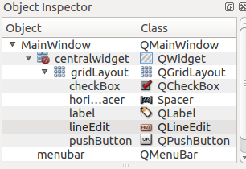

# Qt Designer Kullanımı

PyQt , uygulamamızı tasarlamamız için basit bir tasarımcı uygulama ile gelir. ~~PyQt'yi Windows'a kurduğunuzda modüle ek olarak Qt Designer, Qt Linguist ve Qt Assistant ve bir kaç tane işe yarar betikle gelir.~~ Linux kullanıcıları ise kullandıkları dağıtıma göre depolarında mevcut PyQt yi kursalar da bu uygulamalar ayrı paketler olarak bulunur. O yüzden paket yöneticilerinden arama yaparak bu uygulamaları kurabilirler.

Bu yazı da Qt Designer'a değineceğim. Qt Designer çok işlevsel bir ortam sunmasa da işimizi kolaylaştıran bir tasarımcıdır. Bu uygulama ile arayüzümüzü tasarlayabilir, pencere araçlarına sinyal atayabilir ve resim gibi dosyalarımızı resource özelliği ile uygulamaya gömebiliriz. Öncelikle Qt Designer'i açalım:

Windows kullanıcıları PyQt'yi kurdukları Python sürümünün bulunduğu dizinde bulabilirler. Örnek yol:

```text
C:\Python34\Lib\site-packages\PyQt5\designer.exe
```

Linux kullanıcıları kolayla arama çubuğu aracılığı ile bulabilirler. Örnek:


Uygulamanın açılış ekranı bu şekildedir.


Görülen ekranda ön tanımlı pencere seçenekleri görünüyor. Genelde bir uygulama geliştirirken QMainWindow adında olduğu gibi ana pencere olarak kullanıldığı için Main Window seçilir. Tabii siz Main Window aracına ekleyeceğiniz bir pencere aracına tıklamak suretiyle bir Dialog aracının açılmasını tetikleyebilirsiniz. Ben burada Main Window u seçip anlatmaya devam edeceğim.

Düzenleme yapacağım Main Window aracı içerisinde; menü çubuğu\(QMenuBar\) bilgi çubuğu\(QStatusBar\) ve araç çubuğu\(QToolBar\) barındırabilir. Bu PyQt de QMainWindow sınıfıdır. Bununla beraber bir de QWidget içerir. Bu QWidget arayüzde bulunan pencere araçlarının barındığı alandır. Designer'in sol tarafında çeşitli pencere araçları bulunur. Butonlar\(QPushButton, QToolButton\), etiket\(QLabel\), girdi araçları\(QLineEdit, QTextEdit, QComboBox vs\), pencere düzeni araçları\(QGridLayout, QFromLayout vs.\) gibi.


Sağ tarafında ise en üstte pencere araçlarının pencere üzerindeki ilişki seviyeli ağaç yapısıyla görünür\(**Object Inspector**\). Buradan düzenleme yapmak istediğiniz pencere aracına tıklayıp hemen altında bulunan **Property Editor** kısmından kısıtlı olarak özelleştirme yapabilirsiniz.

 

En Alt da ise uygulamaya eklediğiniz sinyalleri gösteren bir sekme, Menülere eklediğiniz aksiyonlarınızın\(QAction\) bilgisini veren bir başka sekme ve onun yanında ise resource yani kaynak tarayıcısı bulunur.

  

Bir PyQt uygulamasında pencere araçlarınıza sinyal eklemek için tasarımınızı yaptıktan sonra F4 tuşuna basıp sinyal düzenleme moduna geçebilirsiniz. Buradan istediğiniz pencere aracının barındırdığı sinyalleri bir başka pencere aracının yuvasına bağlayabilirsiniz\(Slot\). Tabii kendi sinyalinizi ve slotunuzu yani yuvanızı da yazabilirsiniz, ama bu Qt Designer üzerinde yapılamamakta maalesef. Bir başka yazı da bunu da anlatabilirim...


Bu görüntüde QLineEdit'in returnPressed\(\) sinyalini QPushButton'un animateClick\(\) yuvasına bağlıyoruz. Tamama basınca sinyal eklenmiş oluyor. Sinyal penceresinde ekli olduğunu görebilirsiniz. Tekrar düzenleme moduna dönmek için F3 tuşuna basmanız gerekiyor.

Uygulamanıza menü ve aksiyon eklemek için mevcut Main Window aracınızda ekran görüntüsünde de görüldüğü gibi siyah şerit üzerinde bulunan **Type Here** yazısına tıklayarak menüler, alt menüler ve aksiyonlar ekleyebilirsiniz, kısa yol atayabilirsiniz\(Yalnız bunu belirterek bu kısa yol tuşları çalışmıyor\). **Action Editor** kısmında ise eklediğiniz menüleri ve aksiyonları görebilirsiniz. Ne yazık ki menülere ve aksiyonlara da sinyal ataması yapamıyorsunuz. Aynı şekilde QMainWindow üzerinde bulunabilen QStatusBar ve QToolBar'ı da düzenliyemiyorsunuz. Ancak arayüzümüzü kaydedip Python dosyasına dönüştürdükten sonra elle müdahale edebiliyoruz.


Son olarak Resource Browser kısmında uygulamamızda kullanacağımız resim dosyalarını\(varsa\) ekleyebiliyoruz. Dişli simgesine tıklayınca soldaki gibi bir dialog açılır. Sol altta ki **New source file** butonuna tıklayıp öncelikle qrc dosyamıza isim vererek kaydediyoruz. Sonra sağdaki butonlardan en solda bulunan butona tıklayarak önek oluşturuyoruz. Ben isim kısmını boş bıraktım. Sonra ortadaki butona tıklayarak resim dosyalarımı tek tek bulup kaynak dosyamıza ekleyebiliyoruz. İşimiz bittikten sonra tamam deyip **Resource Browser** sekmesinde eklediğiniz simgeler görünecektir.

Simgeleri pencere araçlarına eklemek için pencere aracını seçip **Property Editor** sekmesinden icon özelliğini seçerek simge ataması yapabilirsiniz. Menü aksiyonlarını da **Action Editor** sekmesinden düzenleyebilirsiniz.

Son olarak Qt Designer de Tool Bar da bulunan butonların ne iş gördüklerine değinelim.


1. Pencere de bulunan pencere araçlarını yatay pozisyonda düzene koyar\(QHBoxLayout\).
2. Bu da pencere araçlarını dikey olarak düzene koyar\(QVBoxLayOut\).
3. Devre dışı duran sonraki iki buton ise iki ayrı pencere aracını yatay ve dikey olarak böler\(QSplitter\). Bunu bir çok yerde görebilirsiniz. Qt Designerin sağ ve sol kısımları da orta kısımla yatay olarak ayrılmıştır. Fareyi pencere araçlarının sınırına getirdiğinizde fare işaretçisinin değişmesinden anlayabilirsiniz.
4. QGridLayout da ızgara düzeniyle pencere araçlarını konumlandırır.
5. QFormLayout ise form tasarımlarında kullanılmak için yatay olarak 2 sütun olmak üzere pencere araçlarınızı düzenlemeye yarar.
6. Eğer Pencerenizi bunları kullanarak düzenlediyseniz ve geri almak isterseniz devre dışı duran ikonu pencere ekranında uygun boş bir yere tıklayıp aktif hale getirebilirsiniz. Bu butonla düzenleyiciyi kaldırabilirsiniz.
7. Son buton ise pencerenizi olabilecek en uygun boyutlara çekmeye yarar.

Qt Designer ile anlatacaklarım bu kadar. Arayüz tasarımızı bitirdikten sonra kaydettiğinizde _.ui uzantılı bir dosya elde edersiniz. Resource dosyanızda xml formatında_ .qrc dosyası olarak kaydedilir.

Bir _.ui dosyasında py dosyası elde etmek için_ .ui dosyanızın olduğu dizine gelip konsolda

```text
pyuic4 arayuz_dosyası.ui -o arayüz.py
```

komutunu vermelisiniz. PyQt5 kullananlar bunu **pyuic5** betiği ile yapabilirler.

Windows kullanıcıları ise bu betikler PATH'e ekli olmadığından PyQt nin kurulu olduğu dizine \*.ui dosyasını atıp cmd ile o dizine girip aynı komutu verebilirler.

Bir \*.qrc dosyasını da Python modülüne çevirmek gerekir. Bunu da

```text
pyrcc4 kaynak.qrc -o kaynak.py
```

komutuyla elde edebilirler\(PyQt5 de pyrcc5 ile\). Bu modülü ana arayüzünüzü çalıştıracağınız modüle import ederek kullanabilirsiniz.

Bir kaynak dosyasını PyQt de kullanabilmek için QtGui paketinde bulunan QIcon modülünü kullanırız. Örnek:

```text
from PyQt4.QtCore import *
from PyQt4.QtGui import *
import kaynak # resource dosyası

class MainWindow(QMainWindow):
    def __init__(self, parent=None):
        super(QMainWindow, self).__init__(parent)
        self.setWindowIcon(QIcon(":/images/simge.png"))
```

Görüldüğü gibi oldukça basit. Yalnız \*.qrc dosyasında simgenizin yolu nasıl ise buraya da aynı yolu yazmalısınız. Tabii ön eki boş bıraktığımız için ":/" dan itibaren yolu gireceksiniz. O yüzden dönüştürme yapmadan önce düzenlemesini yaparsanız sizin için daha iyi olur.

